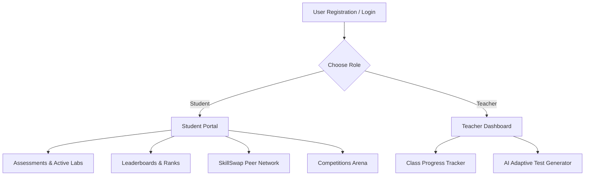

# SkillPath — Personalised Learning & Skill Exchange Platform
### Frontend client-side SPA (React 19 + Vite + Tailwind CSS v4)

Welcome to the frontend application for **SkillPath** — a gamified learning hub built for students and teachers. The client application features a minimal, premium user interface inspired by Cal.com and Mistral AI, prioritizing smooth transitions, micro-interactions, responsive logo visibility, and a complete stroke-based SVG custom icon library.

---

## 🚀 Key Features



### 1. Unified Navigation Layout (Top Navbar)
- **Top Header Bar**: Replaces vertical sidebars with a modern, glassmorphic horizontal navigation header (`backdrop-blur-md`).
- **Responsive Logo Visibility**: The orange logo mark icon is selectively displayed on desktop screens (`xl`) and hides on narrower views to keep the brand text legible.
- **Easy Separation Layout**: High-breathing room gaps (`gap-6` and `px-12`) keep search, statistics capsules, notifications, and user widgets distinct.

### 2. Student Portal
- **Gamified Statistics**: A profile tracker displaying Streaks (flame icon), Coins (coin icon), Global Rank, and XP Levels.
- **Topic Path Recommendations**: Curated course pathways representing DSA, WebDev, Backend, and React topics with dynamic difficulty tags.
- **Competitions Arena**: Active, upcoming, and completed weekly programming challenges.
- **Peer SkillSwap Network**: An emoji-free peer directory allowing students to exchange knowledge and schedule 30-minute study sessions.

### 3. Faculty / Teacher Dashboard
- **Class Analytics**: High-level counters displaying class average scores, total quiz attempts, and pending student reviews.
- **Student Performance Details**: An inspect drawer showing the correctness of each question and specific incorrect student answers.
- **Simulated AI Feedback Generator**: A single-click performance note synthesizer that analyzes gaps and formats constructive, personalized study guides.
- **AI Adaptive Test Creator**: A syllabus selector allowing teachers to check specific topics (e.g., Inheritance, Linked Lists) and generate dynamic, personalized tests that adapt to each student's accuracy profile.

---

## 🛠️ Architecture & Tech Stack

- **React 19** — User interfaces
- **Vite 8** — Next-generation frontend tooling
- **Tailwind CSS v4** — Utility-first styling with `@tailwindcss/vite` integration
- **Vanilla CSS** — Custom design tokens and keyframe animations in `index.css`
- **Lucide-equivalent Custom SVGs** — Custom pixel-perfect stroke icons for zero emoji dependance

---

## 💻 Local Setup & Running

Follow these instructions to run the frontend locally from this folder:

### Prerequisites
- Node.js (v18.0.0 or higher recommended)
- npm package manager

### 1. Install Dependencies
Run this command from inside the `frontend` directory:
```bash
npm install
```

### 2. Start Development Server
Run Vite's rapid hot-reload server locally:
```bash
npm run dev
```
Open `http://localhost:5173/` in your browser.

### 3. Production Build
Verify successful compilation and minification:
```bash
npm run build
```

---

## 📸 Interactive Showcase (Features Overview)

### Student Assessment Sandbox
- When starting an assessment, the student enters a focused screen displaying current progress.
- Features a **Question Navigator** displaying answered, flagged, and unanswered items with real-time timers.

### Teacher Class Progress
- Selecting any student attempt displays a detailed breakdown.
- Click **Generate AI Note** to write performance reviews and resource links automatically:

```
"Hi Alice, Fantastic job on completing the OOPs Test 1! You achieved a perfect score of 100%..."
```

### Adaptive Test Creation Flow
1. Select the Course Lab (OOPs Lab, DSA Lab, etc.).
2. Check specific syllabus topics to cover.
3. Configure duration and turn on **AI Personalized Adaptive** mode.
4. Click **Generate and Publish** to release the test to the student assessment feeds.

---

*SkillPath Learning Platform · sandesh-frontend branch*
